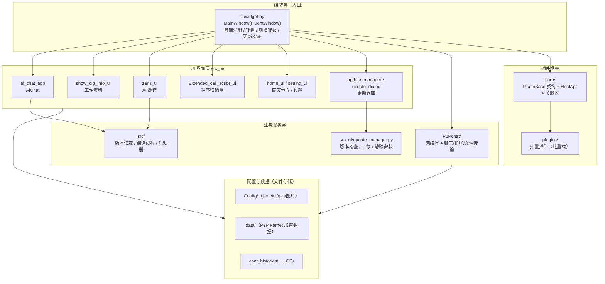
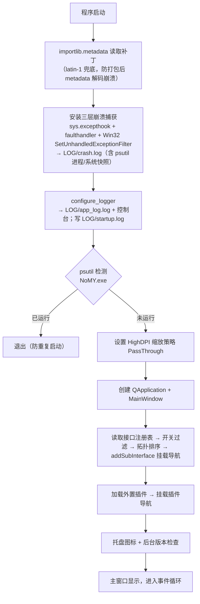
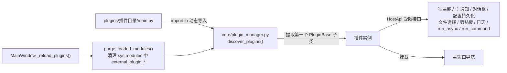
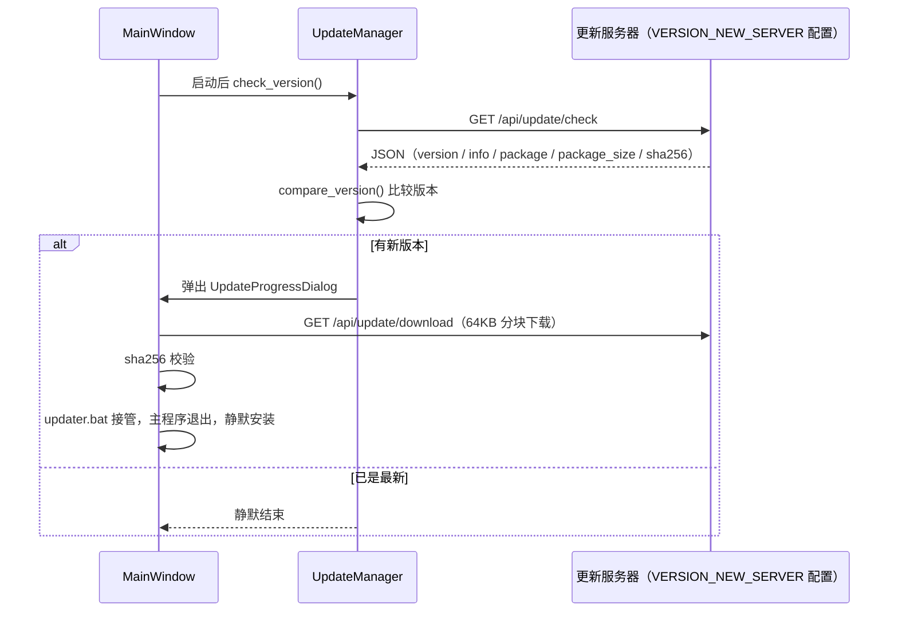
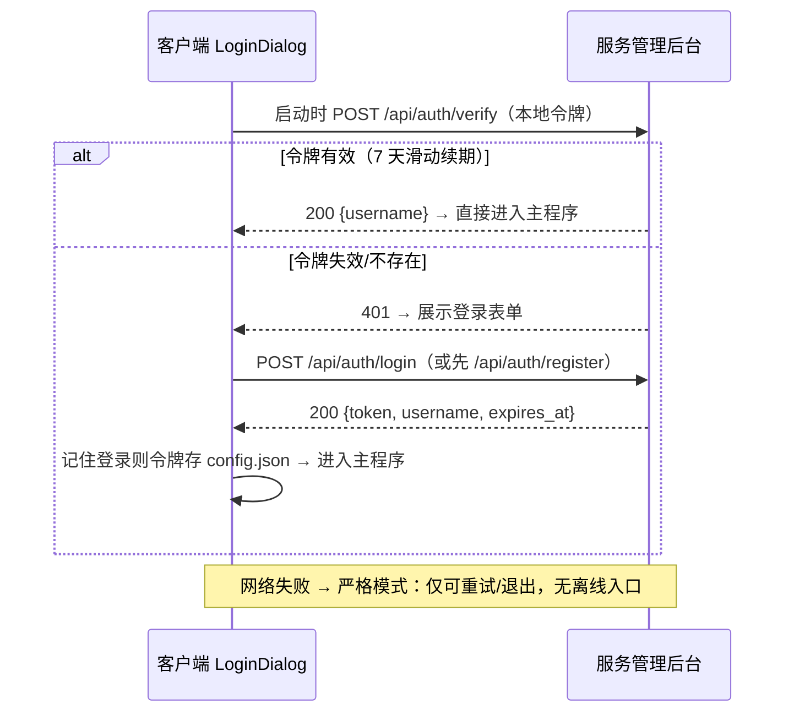

# NoMY 技术框架文档

| 项目 | 说明 |
|---|---|
| 软件名称 | NoMY |
| 当前版本 | V1.0.0（见 `Config/Version.ini`） |
| 开发语言 | Python 3.13（Windows 桌面端） |
| GUI 框架 | PySide6 + PySide6-Fluent-Widgets |
| 用途 | 桌面应用，仅供内部日常工作学习使用 |
| 文档更新日期 | 2026-09-05（v2.0 功能升级后更新） |
| 分析范围 | 69 个 `.py` 文件，约 24,000 行代码（不含 `.venv`/`__pycache__`） |

---

## 1. 项目概述

本项目是 NoMY 桌面应用的**重构精简版**：保留核心功能界面 + 一套可热重载的外置插件系统，已移除历史版本中积累的死代码、无用依赖与个人数据。

### 1.1 功能一览

| 功能键 | 名称 | 说明 | 主要代码 |
|---|---|---|---|
| AUTH | 登录认证 | 邮箱验证码注册、启动登录门、令牌自动登录、离线进入、忘记密码 | `src_ui/login_dialog.py` + `src/auth_client.py` |
| AICHAT | AiChat | AI 模型对话：OpenAI 兼容 API 流式输出、Markdown 渲染、多会话历史 | `src_ui/ai_chat_app.py` |
| DIAINFO | 备忘录 | 富文本备忘（粘贴截图、超链接、自动保存、空态过渡页） | `src_ui/memo_ui.py` |
| EXTEND | 启动器 | 启动项独立页面 + PipsPager 左右分页 | `src_ui/Extended_call_script_ui.py` |
| P2PNWT | 好友 | 服务器中转聊天（微信式）：好友请求-同意制、文本/图片消息、在线状态；SQL 存储 | `src_ui/friends_ui.py` + `server/chat_api.py` |
| MOMENTS | 朋友圈 | 图文动态发布与浏览（好友可见，图片按用户 ID 存服务器） | `src_ui/moments_ui.py` + `server/chat_api.py` |
| IMGSTUDIO | 图片工坊 | PS 式调色修图（八项滑杆 + 滤镜 + 撤销，numpy/PIL 流水线实时过渡预览） | `src_ui/image_studio.py` |
| MUSIC | 音乐播放器 | 本地音频播放（QtMultimedia，列表/模式/进度/音量） | `src_ui/music_player.py` |
| VIDEO | 视频播放器 | 本地视频播放（进度/倍速/全屏/截图，格式取决于系统解码器） | `src_ui/video_player.py` |
| SYSINFO | 电脑配置 | 处理器/内存/显卡/主板/BIOS/系统/磁盘/网络信息（注册表直查 + CIM 兜底） | `src_ui/sysinfo_ui.py` |
| WALLPAPER | 壁纸设置 | 静态/双屏独立/跨屏拼接/定时轮播（ctypes COM IDesktopWallpaper） | `src_ui/wallpaper_ui.py` |
| — | 插件系统 | 外置插件热重载：诊断日志工具、测试备忘录、App 自动化测试等 | `core/` + `plugins/` |

### 1.2 版本信息来源

- `Config/Version.ini`：`VERSION`、`VERSION_INFO`（软件名称/开发语言/用途说明）、`VERSION_NEW`（最新版说明）、`VERSION_LOG`（更新日志）、`VERSION_NEW_SERVER`（更新服务器地址）。
- `src/__init__.py`：读取 Version.ini 暴露 `VERSION` / `VERSION_INFO` / `VERSION_NEW` / `VERSION_LOG` / `UPDATE_SERVER` 常量供全局使用。

---

## 2. 技术栈

### 2.1 运行环境

- **语言**：Python（开发环境为 CPython 3.13，`.venv` 虚拟环境）。
- **平台**：Windows 桌面端（崩溃捕获使用 Win32 异常过滤器等平台能力）。
- **目标产物**：PyInstaller 打包为 `NoMY.exe`（`--onedir --windowed`）。
- **技术特征**：**无数据库、无 Web 框架、无环境变量依赖**——所有配置与数据均为文件式存储（JSON / INI / 加密文件 / HTML / 图片）。

### 2.2 核心依赖（`requirements.txt`，共 36 项，全部精确锁版）

| 分类 | 依赖（版本） | 用途 |
|---|---|---|
| GUI 框架 | `PySide6==6.9.0`（+Addons/Essentials/shiboken6）、`PySide6-Fluent-Widgets==1.11.2`、`PySideSix-Frameless-Window==0.8.0` | Qt6 + Fluent 设计风格控件库（qfluentwidgets）+ 无边框窗口 |
| AI | `openai==2.38.0`、`Markdown==3.10.2`、`pydantic==2.13.4` | OpenAI 兼容 SDK（流式对话/翻译）、对话内容 Markdown 渲染 |
| 加密 | `cryptography==49.0.0` | Fernet(AES-GCM)，用于 P2P 消息与本地配置加密 |
| 系统 | `psutil==7.2.1` | 防重复启动的进程检测、崩溃时进程/系统状态快照 |
| 打包 | `pyinstaller==6.21.0`（+hooks-contrib/altgraph/pefile/future/pywin32-ctypes/setuptools） | 打包发布 |
| 其它 | `httpx` 等 openai 传递依赖 | — |

> 说明：插件 03（App 自动化测试）需要额外依赖 `opencv-python`、`pyyaml`、`uiautomation`、`numpy`、`pillow`，由其自带 `plugins/03_App_Auto_Test_tool/requirements.txt` 单独安装。

---

## 3. 总体架构

### 3.1 分层架构

项目采用「**主窗口组装 + 功能面板 + 服务层 + 插件框架**」结构（非典型 MVC）：



### 3.2 目录结构

```
no-mycode/
├── README.md / 技术框架文档.md / requirements.txt   # 说明文档与依赖清单（根目录）
├── client_code/                # ★ 客户端（Python + PySide6 桌面应用）
│   ├── fluwidget.py            # ★ 唯一主入口（约 870 行）：MainWindow + __main__
│   ├── core/                   # 插件框架
│   │   ├── plugin_api.py       #   PluginMeta / PluginBase / HostApi（261 行）
│   │   └── plugin_manager.py   #   discover_plugins / purge_loaded_modules（81 行）
│   ├── src/                    # 公共工具层
│   │   ├── __init__.py         #   版本与更新服务器常量读取
│   │   ├── auth_client.py      #   认证客户端（/api/auth/* 访问封装，urllib）
│   │   ├── Config_ini.py       #   CONFIGINI：ini 读写封装
│   │   ├── net_config.py       #   服务器地址配置（NetConfig.json）
│   │   └── Extended_Call_Script.py  # 外部 exe/bat 启动器
│   ├── src_ui/                 # ★ UI 界面层（全部功能界面 + 配置中心）
│   │   ├── __init__.py         #   cfg 配置对象、接口注册表、widget_cls_map
│   │   ├── login_dialog.py     #   登录/注册/找回密码对话框（启动登录门）
│   │   ├── user_setting_ui.py  #   用户设置页（头像/改密/退出登录）
│   │   ├── home_ui.py          #   首页卡片导航
│   │   ├── ai_chat_app.py      #   AiChat 界面 ChatWindow（1462 行）
│   │   ├── memo_ui.py          #   备忘录（富文本，原 show_dig_info_ui）
│   │   ├── Extended_call_script_ui.py  # 启动器（程序归纳盒）
│   │   ├── friends_ui.py       #   好友聊天（服务器中转，微信式）
│   │   ├── moments_ui.py       #   朋友圈
│   │   ├── image_studio.py     #   图片工坊（调色修图）
│   │   ├── music_player.py     #   音乐播放器（QtMultimedia）
│   │   ├── video_player.py     #   视频播放器（QtMultimedia）
│   │   ├── sysinfo_ui.py       #   电脑配置查看
│   │   ├── wallpaper_ui.py     #   桌面壁纸设置
│   │   ├── setting_ui.py       #   设置界面
│   │   ├── update_manager.py / update_dialog.py   # 更新逻辑与进度对话框
│   │   └── information_history.py  # InfoBar 通知封装
│   ├── plugins/                # ★ 外置插件目录（热重载）：example_tool 插件开发模板
│   ├── Config/                 # 全部配置与资源（config.json / Version.ini / qss 主题 / 图片 / DigInfo 数据）
│   ├── chat_histories/         # AI 对话历史（运行时生成）
│   ├── Screenshots/            # 视频播放器截图（运行时生成）
│   ├── LOG/                    # app_log / crash.log / startup.log（运行时生成）
│   └── build_app.bat           # 客户端打包为 exe（Nuitka standalone）
└── server_code/                # ★ 服务端（独立进程，纯标准库）
    ├── server/                 # Windows 版
    │   ├── distribute_server.py        # HTTP 服务：/api/auth/* + /api/update/*
    │   ├── distribute_server_gui.py    # 管理后台 GUI（PySide6 + qfluentwidgets）
    │   ├── auth_store.py               # 账号/会话存储 + 防爆破
    │   ├── security.py                 # 限流 + 敏感配置落盘加密（protect_secret）
    │   ├── mail_service.py             # SMTP 邮件服务（验证码/测试邮件）
    │   ├── chat_api.py                 # 聊天/好友/朋友圈 HTTP API
    │   ├── db.py                       # SQLite 数据层（用户/好友/消息/朋友圈）
    │   ├── web/index.html              # 软件信息展示 + 下载页
    │   ├── server_data/                # 运行时数据：users.json / sessions.json / server_config.json / secret.key
    │   └── build_exe.bat               # 服务端打包（Nuitka）
    └── server_linux/           # Linux 部署版（含 noMY-server.service systemd 单元）
```

### 3.3 启动流程

主入口 `fluwidget.py`，启动时序如下：



---

## 4. 核心机制详解

### 4.1 动态导航与接口注册表

- `src_ui/__init__.py` 中的 `get_interface_registry()` 返回接口注册表，每项包含 `key / widget_cls / icon / display_name / parent_key`。
- `get_active_interfaces()` 按 `cfg`（`Config/config.json`，qfluentwidgets QConfig）中的开关过滤功能项；`get_active_order()` 支持用户自定义排序。
- `get_parent_map()` + `fluwidget.py` 的 `_topo_sort` 拓扑排序生成**多级导航**；`widget_cls_map` 将字符串类名映射到实际 QFrame 子类后动态实例化。
- 首页卡片导航：`src_ui/home_ui.py` 的 `SampleCardView`/`SampleCard` 通过全局 `signalBus.switchToSampleCard` 信号切换页面。

### 4.2 插件系统（热重载）

契约与加载器分离，插件失败不拖垮主程序：



- **契约**（`core/plugin_api.py`，261 行）：`PluginMeta`（元数据）、`PluginBase`（生命周期基类）、`HostApi`（受限宿主接口，避免插件直接操作主窗口）。
- **加载**（`core/plugin_manager.py`，81 行）：按 `plugins/<目录>/main.py` 约定发现插件；加载失败仅记录日志，不影响主程序。
- **热重载**：`purge_loaded_modules()` 清除已加载插件模块后重新发现，可在运行时刷新插件。
- **内置插件**：`example_tool`（开发模板）、`01_Diag_Log_tool`（车型日志处理）、`02_Test_Memo_tool`（测试备忘录）、`03_App_Auto_Test_tool`（App 自动化测试框架——YAML 用例 + 录制器 + 执行器 + HTML 报告，双引擎：坐标找图 / adb uiautomator 元素定位）。

### 4.3 更新体系



- **服务器地址**：唯一来源为 `Config/Version.ini` 的 `VERSION_NEW_SERVER`（默认模板值 `http://127.0.0.1:18888`），由 `src/__init__.py` 读为 `UPDATE_SERVER`；代码中无其他硬编码端点。
- **分发服务器**：`server/distribute_server.py`（纯标准库 `http.server.ThreadingHTTPServer`，支持 IP 白名单）把任一机器变为更新源；`distribute_server_gui.py` 为其 Tkinter 图形壳。

### 4.4 AI 集成

- AI 对话与 AI 翻译共用 OpenAI 兼容接口，配置在 `Config/Aisetting.json`（`api_key` / `base_url` / `model` / `system_prompt`；出厂模板为占位配置，使用前需自行填写）。
- 流式实现：`src_ui/ai_chat_app.py` 的 `AIWorker(QThread)` 调用 `client.chat.completions.create(stream=True)`，通过 `response_chunk` 信号逐段回传 UI 线程渲染。
- 会话持久化：`chat_histories/*.json`，结构 `{title, preview, time, model, history:[{content, role}]}`。

### 4.5 P2P 内网通（独立子应用）

| 项 | 说明 |
|---|---|
| 节点发现 | UDP 广播，端口 **18999** |
| 消息/文件传输 | TCP，端口基 **19000** 起，支持配置额外网段（默认 192.168.1） |
| 消息加密 | Fernet(AES-GCM)，密钥 `sha256(b"PyChatNet_2024")`（`P2Pchat/network_manager.py:17`） |
| 本地数据加密 | Fernet，密钥 `sha256(b"PyChatFile_2024")`（`P2Pchat/config_manager.py`），落盘根目录 `data/*.dat` |
| 群聊协议 | 文本命令 `[GROUP:INVITE\|MSG\|DISBAND\|QUIT\|SYNC\|STATE]`（见 `P2Pchat/group_manager.py` 头注释） |
| 通知桥接 | 主窗口收到 P2P 消息/文件请求时经 InfoBar 通知并置顶提醒 |

### 4.6 账号认证体系（服务管理后台）

客户端与服务端同址部署（地址同 `VERSION_NEW_SERVER`）。服务端为 `server/distribute_server.py`（纯标准库 ThreadingHTTPServer），管理界面 `server/distribute_server_gui.py`（PySide6 + qfluentwidgets，与服务线程同进程共享账号/会话数据）。



**认证 API**（POST JSON，受子网白名单约束）：

| 端点 | 请求 | 成功响应 | 失败 |
|---|---|---|---|
| `/api/auth/register` | `{username, password}` | 201 `{ok, username}` | 400 参数/重名；403 注册开关关闭 |
| `/api/auth/login` | `{username, password}` | 200 `{ok, token, username, expires_at}` | 401 凭据错误/禁用；429 触发防爆破 |
| `/api/auth/verify` | `{token}` | 200 `{ok, username, expires_at}`（滑动续期） | 401 失效 |
| `/api/auth/logout` | `{token}` | 200 `{ok}` | — |
| `/api/auth/send_code` | `{email, purpose}`（register/reset） | 200 `{ok}`（60s 冷却） | 400 邮箱非法；429 频繁；503 SMTP 未配置 |
| `/api/auth/reset_password` | `{email, code, new_password}` | 200 `{ok}`（注销该账号全部会话） | 400 验证码错误/邮箱未绑定 |
| `/api/auth/change_password` | `{token, old_password, new_password}` | 200 `{ok}`（注销该用户其他会话，保留当前） | 401 令牌失效；400 旧密码错误/新密码不合法 |

**安全设计**：
- 密码服务端 PBKDF2-HMAC-SHA256（12 万轮）加盐哈希存储，数据库泄露不泄密；登录失败与账号不存在返回一致文案，防账号枚举；
- 令牌 `secrets.token_hex(32)`，7 天滑动过期，会话持久化于 `server/server_data/sessions.json`（服务重启不掉线），单用户最多 5 个会话；
- 防爆破：同 IP 5 分钟窗口内失败 ≥10 次临时拒绝（429）；
- 管理端能力（同进程 GUI）：新建账号、重置密码（重置后强制该用户全部会话下线）、禁用/启用、删除、踢下线、开放注册开关；
- 传输为内网 HTTP 明文，仅限可信局域网使用（如需外网需自行加 TLS 反代）。

**客户端集成点**：`fluwidget.py` `__main__` 在 MainWindow 之前弹出登录门；`src/auth_client.py`（urllib，超时 8s）；令牌/用户名/记住开关存于 `Config/config.json` 的 `Auth` 组；主导航「设置」上方有「用户设置」页（`src_ui/user_setting_ui.py`，AvatarWidget 圆形文字头像 + 自助修改密码 + 记住登录开关 + 退出登录）。

---

## 5. 数据与配置

### 5.1 配置文件一览（全部文件式，无环境变量）

| 文件/目录 | 机制 | 内容 |
|---|---|---|
| `Config/config.json` | qfluentwidgets QConfig（`src_ui/__init__.py` 的 `Config` 类） | 菜单开关/排序/层级、窗口尺寸、退出行为、主题色、更新选项 |
| `Config/Version.ini` | configparser（`src/Config_ini.py`，UTF-8） | 版本号、版本信息、更新说明、更新服务器地址 |
| `Config/Aisetting.json` | 手写 JSON | AI 配置：api_key、base_url、model、system_prompt |
| `Config/Text.ini` | configparser | UI 文案字典（TEXT section → `TEXT_DICT`，仅保留在用键） |
| `Config/ExtendedCallScript.json` | JSON | 程序归纳盒脚本列表 |
| `Config/Default_info.json` | JSON | 工作资料"恢复默认"数据源（出厂为空列表） |
| `Config/HistoryPath/*` | 隐藏点文件 | 各界面"上次选择目录"记忆（运行时生成） |
| `data/*.dat`（P2P） | Fernet 加密 JSON | 用户名/颜色/接收目录/额外网段/免打扰、好友、群数据（运行时生成） |

### 5.2 数据存储

- `Config/DigInfo/`：工作资料条目（`index.json` + `order.json` + `notes/*.html` + `images/`），2 秒自动保存。
- `chat_histories/`：AI 多会话历史（JSON）。
- `LOG/`：`app_log.log`（主日志，设置页"清除缓存"可清空）、`crash.log`（含 psutil 快照）、`startup.log`。

### 5.3 外部端点

| 端点 | 用途 |
|---|---|
| `VERSION_NEW_SERVER`（默认 `http://127.0.0.1:18888`） | 服务管理后台：`/api/auth/*`（注册/登录/验证/登出）、`/api/update/check`、`/api/update/download`、`/health` |
| `Aisetting.json` 的 `base_url`（默认 OpenAI 占位） | OpenAI 兼容 AI 接口（对话 + 翻译） |
| UDP 18999 / TCP 19000+ | P2P 内网通发现与传输 |

---

## 6. 构建与运行

### 6.1 运行

```bash
pip install -r requirements.txt   # 在仓库根目录执行
cd client_code                    # 必须进入 client_code/ 运行（依赖 ./Config、./LOG 等相对路径）
python fluwidget.py
```

启动时自动创建缺失目录；psutil 检测 `NoMY.exe` 进程防止重复启动。启动后先经过登录门（严格验证，见 4.6 节），需先在服务管理后台开启服务并注册/创建账号。AI 功能需先在 `Config/Aisetting.json` 填写 api_key/base_url。

### 6.2 打包（PyInstaller）

打包命令见 `fluwidget.py` 尾部注释：

```bash
pyinstaller --noconfirm --onedir --windowed --icon "Config\image\menu.ico" --name "NoMY" fluwidget.py
```

打包后支持将插件放到 exe 旁的 `plugins/` 目录（`_get_plugins_dir()` 含 frozen/_MEIPASS 分支处理）。

### 6.3 服务管理后台

```bash
python server/distribute_server_gui.py                                # PySide6 管理后台（推荐）
python server/distribute_server.py --port 18888                       # 命令行版（仅认证）
python server/distribute_server.py --package setup.exe --port 18888   # 命令行版（认证 + 更新分发）
python server/distribute_server.py --no-registration                  # 关闭开放注册
```

详见 4.6 节。GUI 版与服务线程同进程，可直接管理账号与会话。

### 6.4 测试与 CI

无单元测试框架、无 CI 配置、无 Dockerfile。`03_App_Auto_Test_tool` 插件本身是一套 App UI 自动化测试框架（YAML 用例 + 录制 + 执行 + HTML 报告），但项目自身代码无自动化测试。

---

## 7. 代码规模统计

共 **59 个 `.py` 文件，约 19,000 行**（不含 `.venv`/`__pycache__`）。

| 模块 | 行数 | 主要文件 |
|---|---|---|
| `plugins/` | ~6,400 | 03_App_Auto_Test_tool ~4,300；01_Diag_Log_tool 902；02_Test_Memo_tool 479；example_tool ~270 |
| `P2Pchat/` | ~4,900 | main_window.py 1815、network_manager.py 1045、chat_panel.py 578 |
| `src_ui/` | ~5,100 | ai_chat_app.py 1462、show_dig_info_ui.py ~800、login_dialog.py 280、setting_ui.py ~530 |
| `server/` | ~1,470 | distribute_server.py 557、distribute_server_gui.py 600、auth_store.py 312 |
| `fluwidget.py` | ~880 | 入口 + MainWindow + 登录门 |
| `core/` | 343 | plugin_api.py 261、plugin_manager.py 81 |
| `src/` | ~250 | auth_client.py 53、Translation 58、Config_ini 54、Extended_Call_Script 44、__init__.py ~40 |

---

## 8. 项目整理记录（2026-09-05）

本项目已完成一轮系统清理，此前存在的遗留问题均已处理：

1. **删除死代码**：`src_ui/gen_ui.py`（引用不存在的 `src.gen_msg`）、`fluwidget.py` 的 `on_devices_changed`/`_stop_airtest_worker`/`flash_thread` 死块/19 个死界面属性占位/P2P 角标残壳、`src_ui/__init__.py` 的 `analyze_ini`/`check_text_block`、`src/__init__.py` 的设备信息字典与 AES 解密机制、`home_ui.addcard`、工作资料旧配置迁移代码、example_tool 中引用不存在 `src.adb_tools` 的按钮。
2. **删除无用文件**：`Config/airtest_config.json`、`Config/InfoCustom.json`、`Config/InfoOrder.json`、`Config/data/`（aes.bin/Hyh.enc）、无引用图片与 qss、`@AutomationLog.txt`。
3. **依赖瘦身**：requirements.txt 由 75 项精简至 36 项（移除 requests/bs4/pycryptodome/PyAutoGUI 家族/pywin32/Eel 全家/customtkinter/pandas/numpy/pillow 等），移除了随之失效的 `auto-py-to-exe`（其依赖 Eel 已删，打包直接使用 pyinstaller 命令）。
4. **配置精简**：`Config/Text.ini` 262 键瘦身至在用的 10 键；`config.json` 移除投屏（Scrcpy）组等无消费项；设置页移除"重启 ADB 服务"与投屏 4 张卡片。
5. **运行数据重置**：LOG、chat_histories、DigInfo 资料、P2P 数据、HistoryPath 均重置为空白初始态。
6. **保留项**：`plugins/01_Diag_Log_tool/main.py` 的 `ro.topdon.build.version` 为设备 Android 属性键（功能性读取，非信息泄露）。

---

## 附录：关键文件索引

| 类别 | 文件 |
|---|---|
| 入口/主窗口/登录门 | [fluwidget.py](fluwidget.py) 、[src_ui/login_dialog.py](src_ui/login_dialog.py) |
| 配置中心与接口注册表 | [src_ui/__init__.py](src_ui/__init__.py) |
| 认证客户端 | [src/auth_client.py](src/auth_client.py) |
| 版本信息 | [Config/Version.ini](Config/Version.ini) |
| 依赖清单 | [requirements.txt](requirements.txt) |
| 插件契约/加载器 | [core/plugin_api.py](core/plugin_api.py) 、[core/plugin_manager.py](core/plugin_manager.py) |
| P2P 网络层 | [P2Pchat/network_manager.py](P2Pchat/network_manager.py) 、[P2Pchat/config_manager.py](P2Pchat/config_manager.py) |
| 服务管理后台 | [server/distribute_server.py](server/distribute_server.py) 、[server/distribute_server_gui.py](server/distribute_server_gui.py) 、[server/auth_store.py](server/auth_store.py) |
| 更新体系 | [src_ui/update_manager.py](src_ui/update_manager.py) |
